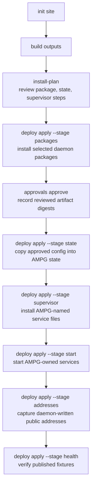
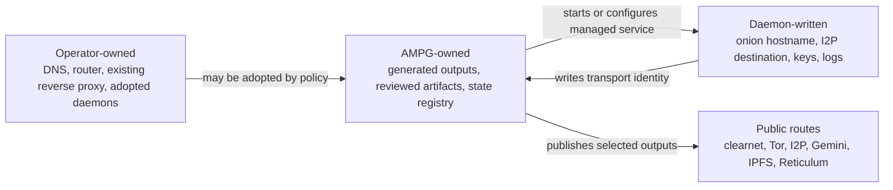
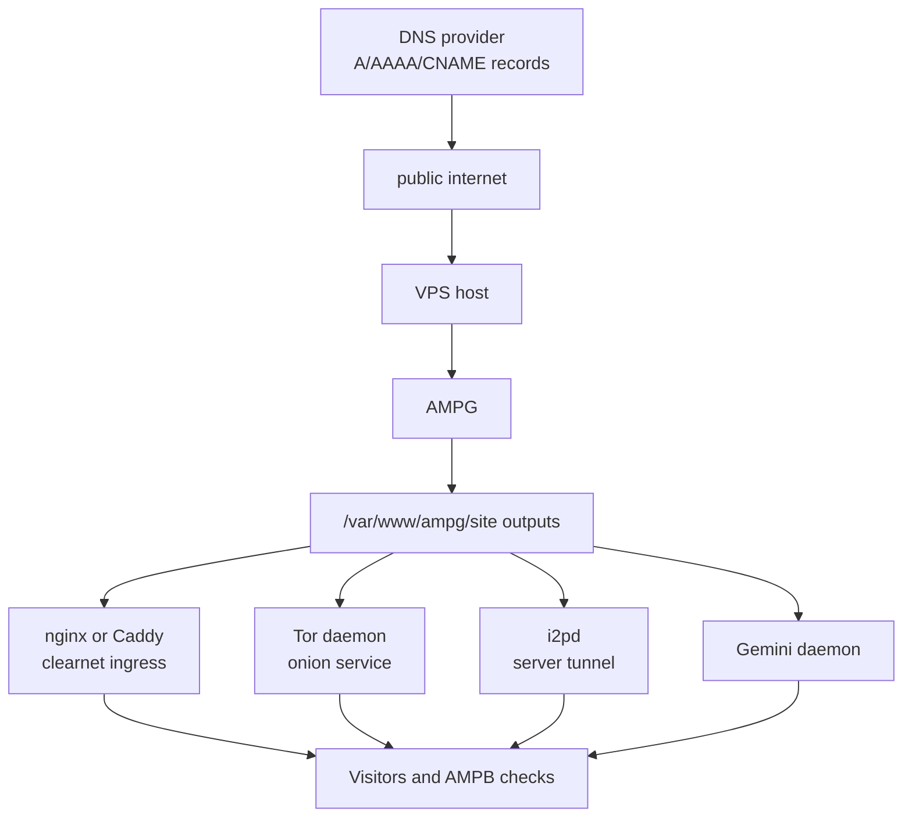
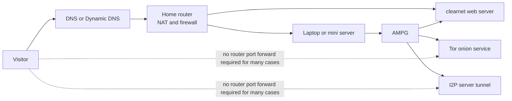
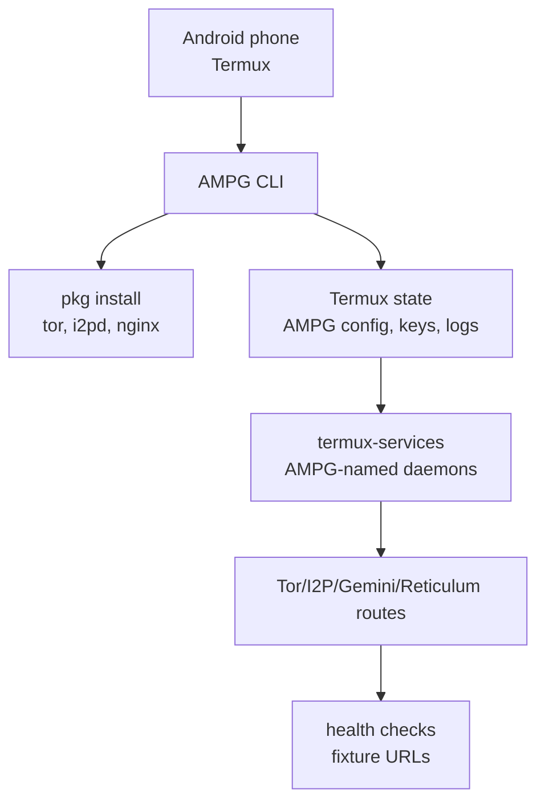
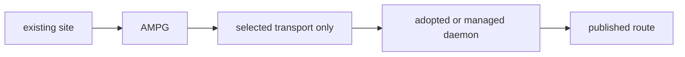
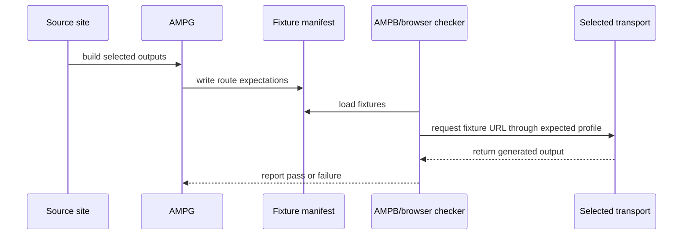

# Visual Guide

> Status: draft | Updated 2026-07-07 | Applies to: AMPG operators and contributors

This guide shows the core AMPG flows and common deployment topologies. Diagrams use
Mermaid so they render in GitHub Markdown and can later be reused by a public docs site.

## Build Flow

AMPG starts from one canonical site and renders transport-appropriate outputs. Rich web
output can stay rich on clearnet, while constrained or privacy-oriented transports get
safer defaults.

```mermaid
flowchart LR
  source["Source site<br/>static HTML, Markdown, or generated output"]
  graph["AMPG content graph"]
  clearnet["clearnet<br/>HTML/CSS/assets"]
  tor["Tor<br/>privacy HTML"]
  i2p["I2P<br/>privacy HTML"]
  gemini["Gemini<br/>Gemtext"]
  ipfs["IPFS<br/>static tree"]
  reticulum["Reticulum<br/>Micron"]
  manifest["fixture manifest<br/>routes and expected transports"]

  source --> graph
  graph --> clearnet
  graph --> tor
  graph --> i2p
  graph --> gemini
  graph --> ipfs
  graph --> reticulum
  clearnet --> manifest
  tor --> manifest
  i2p --> manifest
  gemini --> manifest
  ipfs --> manifest
  reticulum --> manifest
```

## Deployment Spine

Live deploy work is split into narrow stages. Each stage has a dry-run form first, and
live stages require explicit confirmation.



## Ownership Boundaries

AMPG tries to keep operator-owned services, AMPG-owned generated state, and
daemon-written identity material distinct.



## VPS Multi-Transport

A normal VPS is the cleanest full-stack topology. AMPG can adopt existing daemons or
manage missing ones, while clearnet DNS and TLS remain operator-controlled by default.



## Home Server Behind A Router

Behind-router clearnet publishing may need port forwarding, IPv6, Dynamic DNS, a reverse
tunnel, or DNS-01 certificate validation. Tor and I2P can often avoid inbound clearnet
port forwarding.



## Android Or Termux Server

An old phone can be useful for mobile-server experiments. AMPG plans user-space daemons,
Termux package installs, and service scripts, while battery policy, storage, and public
reachability remain device-owned.



## Single-Transport Deployments

AMPG should also work when the operator wants only one selected transport. This is useful
for I2P-only, Tor-only, Gemini-only, or Reticulum-focused deployments.



## Browser Test Loop

AMPG writes fixture manifests so a companion browser or checker can verify that each
route uses the expected transport profile.



## Public Docs Site Path

The first public docs site should be generated from the public Markdown docs in this
repository. A GitHub Pages build can later reuse these Mermaid diagrams with MkDocs,
mdBook, or another static docs generator. Private strategy notes, deployment inventory,
and host-specific material should stay under private docs and outside any Pages build.

## Example Site Roles

`ampgateway.online`
: Public system guide. It explains AMPG concepts, transport flows, topologies, domain
  onboarding, and deploy stages. It should stay concise, visual, and operator-facing.

`ampgateway.site`
: Public demo site. It should behave like a real small site someone might deploy: static
  catalog, plain form fallback, optional clearnet enhancement, and comments in source
  that explain how the same content survives privacy HTML, Gemtext, and Micron outputs.

Both sites are source inputs consumed by AMPG. Clearnet output can remain visually rich;
Tor and I2P use privacy HTML; Gemini uses Gemtext; Reticulum uses Micron.
